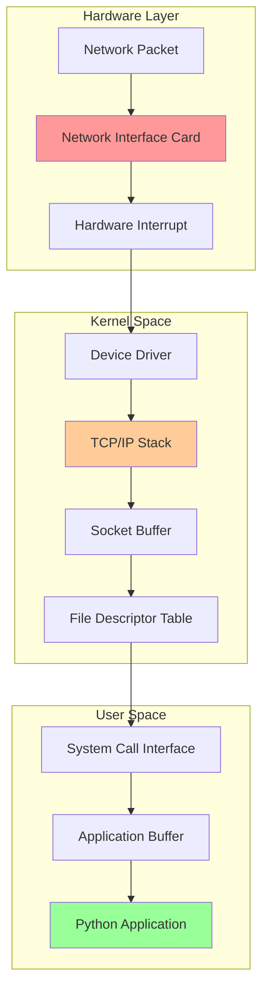
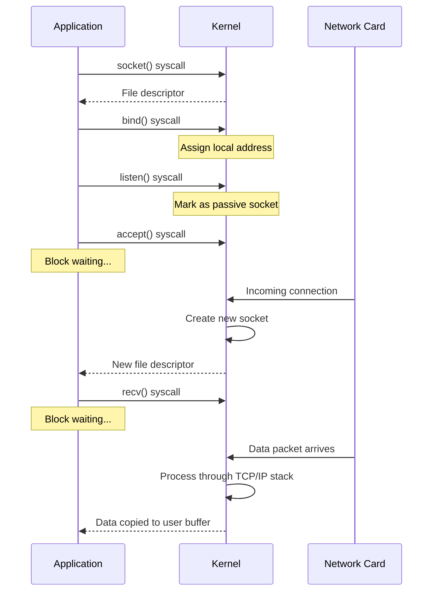

# Module 1: Networking Fundamentals

## Table of Contents

- [Overview](#overview)
- [Learning Objectives](#learning-objectives)
- [The Network Stack Journey](#the-network-stack-journey)
- [Key Concepts](#key-concepts)
- [Hands-On Examples](#hands-on-examples)
- [Performance Insights](#performance-insights)
- [Quick Exercise](#quick-exercise)
- [Key Takeaways](#key-takeaways)
- [Next Module](#next-module)

## Overview

This module explores the foundational concepts of network programming in Python, covering how data travels from the Network Interface Card (NIC) through the kernel to your application.

**Duration**: 4 minutes

## Learning Objectives

* Understand file descriptors and their role in I/O operations
* Learn how sockets work at the system level
* Explore the journey of network packets from NIC to application
* Understand the cost of system calls

## The Network Stack Journey



## Key Concepts

### File Descriptors

A file descriptor is a non-negative integer that uniquely identifies an open file or socket within a process. In Unix-like systems, everything is a file - including network connections.

```python
# Example: File descriptors in action
import os
import socket

# Create a socket - this returns a file descriptor
sock = socket.socket(socket.AF_INET, socket.SOCK_STREAM)
print(f"Socket file descriptor: {sock.fileno()}")

# Standard file descriptors
print(f"stdin: {sys.stdin.fileno()}")   # Usually 0
print(f"stdout: {sys.stdout.fileno()}")  # Usually 1
print(f"stderr: {sys.stderr.fileno()}")  # Usually 2
```

### Network Interface Card (NIC)

The NIC is responsible for:

1. **Receiving packets**: Physical signals → Digital data
2. **DMA transfers**: Direct Memory Access bypasses CPU for efficiency
3. **Interrupt generation**: Notifies CPU of incoming data
4. **Checksum offloading**: Hardware-accelerated error checking

### Socket Lifecycle



## Hands-On Examples

### Example 1: Basic Socket Creation (`01_socket_basics.py`)

```python
# Run this example to explore socket and file descriptor basics
python 01_socket_basics.py
```

### Example 2: Monitoring File Descriptors (`02_fd_monitor.py`)

```python
# Monitor file descriptors in real-time
python 02_fd_monitor.py
```

### Example 3: Network Packet Path Simulation (`03_packet_journey.py`)

```python
# Visualize the journey of a network packet
python 03_packet_journey.py
```

## Performance Insights

### System Call Overhead

Each transition from user space to kernel space has a cost:

| Operation | Typical Time | Impact |
|-----------|--------------|---------|
| System call overhead | ~100-300ns | Context switch, privilege level change |
| Data copy (1KB) | ~500ns | Memory bandwidth limited |
| Network RTT (local) | ~50μs | Kernel processing + wire time |

### Zero-Copy Techniques

Modern systems use techniques to avoid copying data:

1. **sendfile()**: Transfer data between file descriptors without copying through user space
2. **mmap()**: Map kernel buffers directly into user space
3. **io_uring**: New Linux API for asynchronous I/O with shared memory rings

## Quick Exercise

Run the examples in order:

```bash
# 1. Explore socket and file descriptor basics
python 01_socket_basics.py

# 2. Monitor file descriptors in real-time
python 02_fd_monitor.py

# 3. Visualize packet journey simulation
python 03_packet_journey.py
```

## Key Takeaways

✅ File descriptors are the interface between user space and kernel resources

✅ Network data travels through multiple layers, each adding processing time

✅ System calls are expensive - batch operations when possible

✅ Modern NICs offload many operations to hardware for efficiency

## Next Module

[Module 2: API Request Lifecycle](../02-api-lifecycle/README.md) - See how HTTP requests are processed by web servers
