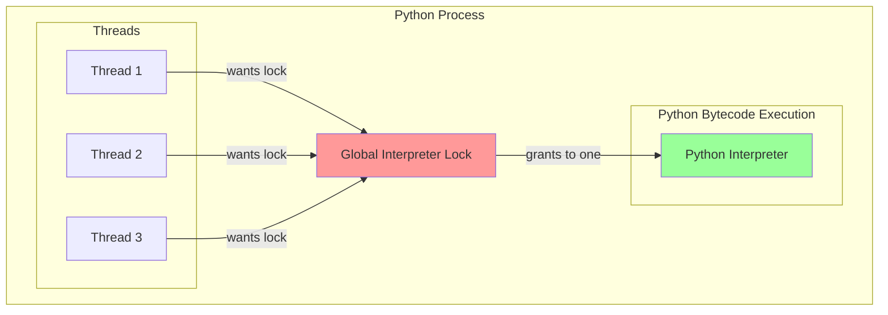
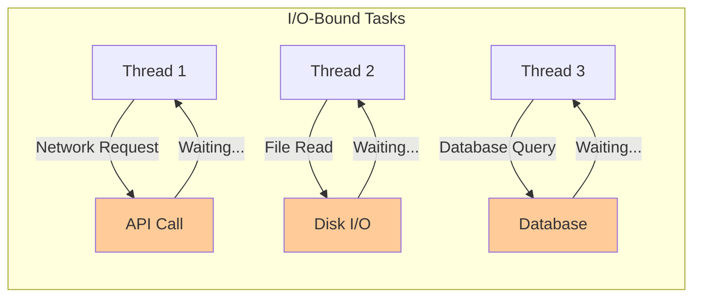
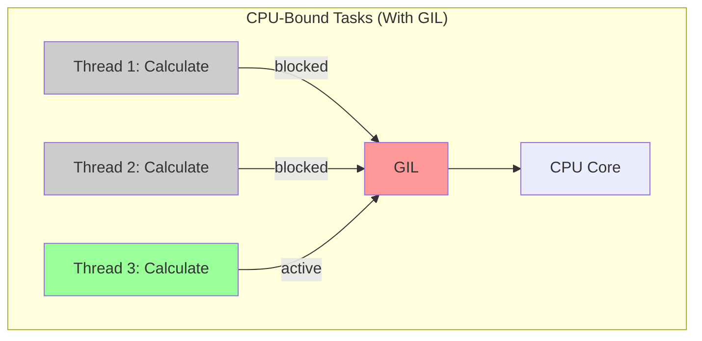
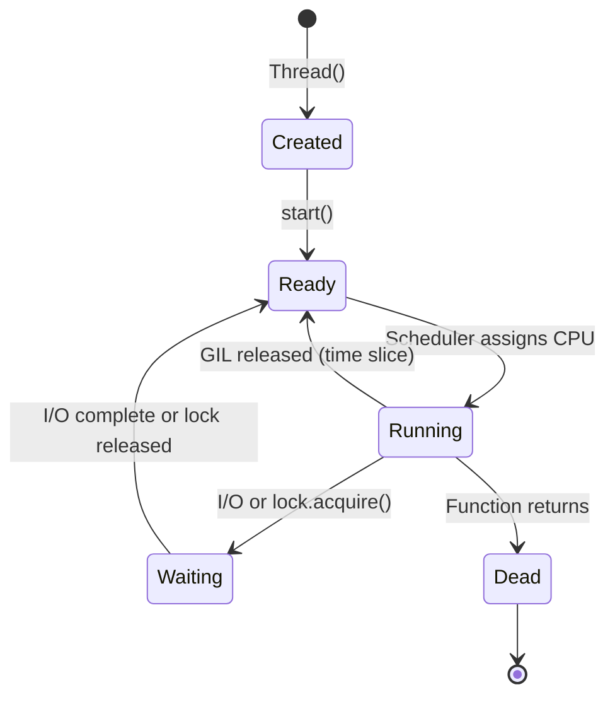

# Module 3: Multithreading in Python

## Table of Contents

- [Overview](#overview)
- [Learning Objectives](#learning-objectives)
- [The Global Interpreter Lock (GIL)](#the-global-interpreter-lock-gil)
- [Threading Use Cases](#threading-use-cases)
- [Thread Synchronization Primitives](#thread-synchronization-primitives)
- [Thread Lifecycle](#thread-lifecycle)
- [Hands-On Examples](#hands-on-examples)
- [Performance Characteristics](#performance-characteristics)
- [Best Practices](#best-practices)
- [Quick Exercise](#quick-exercise)
- [Key Takeaways](#key-takeaways)
- [Common Pitfalls](#common-pitfalls)
- [Next Module](#next-module)

## Overview

This module explores Python's threading capabilities for handling concurrent operations. We'll examine the Global Interpreter Lock (GIL), understand when threading is beneficial, and learn best practices for multi-threaded applications.

**Duration**: 4 minutes

## Learning Objectives

* Understand Python's Global Interpreter Lock (GIL) and its implications
* Learn when threading provides performance benefits
* Master thread synchronization primitives
* Explore thread pools and concurrent execution patterns
* Understand the difference between I/O-bound and CPU-bound tasks

## The Global Interpreter Lock (GIL)



### Key Points about the GIL

1. **Only one thread executes Python bytecode at a time**
2. **GIL is released during I/O operations**
3. **Native extensions can release the GIL**
4. **Context switching happens every ~5ms (sys.getswitchinterval())**

## Threading Use Cases

### Good for Threading (I/O-Bound)



* Network requests
* File I/O operations
* Database queries
* User input waiting

### Bad for Threading (CPU-Bound)



* Mathematical computations
* Image/video processing
* Data compression
* Cryptographic operations

## Thread Synchronization Primitives

### Lock (Mutex)

Ensures only one thread accesses a resource at a time.

```python
lock = threading.Lock()

with lock:
    # Critical section
    shared_resource += 1
```

### RLock (Reentrant Lock)

A lock that can be acquired multiple times by the same thread.

```python
rlock = threading.RLock()

def recursive_function(n):
    with rlock:
        if n > 0:
            recursive_function(n - 1)
```

### Semaphore

Limits the number of threads accessing a resource.

```python
sem = threading.Semaphore(3)  # Max 3 threads

with sem:
    # Up to 3 threads can be here
    access_limited_resource()
```

### Event

Allows threads to wait for a condition.

```python
event = threading.Event()

# Thread 1
event.wait()  # Block until set

# Thread 2
event.set()   # Wake up waiting threads
```

### Condition

More complex signaling between threads.

```python
condition = threading.Condition()

# Consumer
with condition:
    while not item_available:
        condition.wait()
    consume_item()

# Producer
with condition:
    produce_item()
    condition.notify_all()
```

## Thread Lifecycle



## Hands-On Examples

### Example 1: GIL Demonstration (`01_gil_demo.py`)

```python
# See GIL impact on CPU vs I/O tasks
python 01_gil_demo.py
```

### Example 2: Thread Pool Patterns (`02_thread_pools.py`)

```python
# Compare thread pool implementations
python 02_thread_pools.py
```

### Example 3: Synchronization Primitives (`03_synchronization.py`)

```python
# Explore synchronization mechanisms
python 03_synchronization.py
```

## Performance Characteristics

### Threading Overhead

| Operation | Typical Time | Notes |
|-----------|--------------|-------|
| Thread creation | ~100-500 μs | OS thread + Python structures |
| Context switch | ~1-10 μs | Depends on CPU and OS |
| Lock acquire/release | ~0.1-1 μs | Uncontended lock |
| GIL acquire/release | ~0.05-0.5 μs | Happens frequently |
| Thread join | Variable | Depends on thread completion |

### GIL Impact on Performance

| Task Type | Single Thread | Multi Thread | Recommendation |
|-----------|---------------|--------------|----------------|
| Pure CPU computation | 1.0x | 0.8-1.1x | Use multiprocessing |
| I/O with little CPU | 1.0x | 2-10x | Threading is ideal |
| Mixed I/O and CPU | 1.0x | 1.2-3x | Consider async or hybrid |
| NumPy/Pandas operations | 1.0x | 1.0-4x | Often releases GIL |

## Best Practices

### 1. Use Thread Pools

```python
# Good: Reuse threads
with ThreadPoolExecutor(max_workers=10) as executor:
    futures = [executor.submit(task, arg) for arg in args]
    results = [f.result() for f in futures]

# Bad: Create new thread for each task
threads = []
for arg in args:
    t = Thread(target=task, args=(arg,))
    t.start()
    threads.append(t)
```

### 2. Minimize Lock Contention

```python
# Good: Fine-grained locking
class Counter:
    def __init__(self):
        self._lock = threading.Lock()
        self._count = 0
    
    def increment(self):
        with self._lock:
            self._count += 1  # Quick operation

# Bad: Coarse-grained locking
def process_all(items):
    with global_lock:
        for item in items:  # Long operation under lock
            process(item)
```

### 3. Avoid Deadlocks

```python
# Good: Always acquire locks in same order
def transfer(from_account, to_account, amount):
    first, second = sorted([from_account, to_account], key=id)
    with first.lock:
        with second.lock:
            from_account.withdraw(amount)
            to_account.deposit(amount)
```

### 4. Use Queue for Thread Communication

```python
# Good: Thread-safe communication
queue = Queue()

# Producer
queue.put(item)

# Consumer
item = queue.get()
queue.task_done()
```

## Quick Exercise

Run the examples to explore threading behavior:

```bash
# 1. See GIL impact on CPU vs I/O tasks
python 01_gil_demo.py

# 2. Compare thread pool implementations
python 02_thread_pools.py

# 3. Explore synchronization primitives
python 03_synchronization.py
```

## Key Takeaways

✅ The GIL prevents true parallel execution of Python bytecode

✅ Threading excels for I/O-bound tasks where threads spend time waiting

✅ Use thread pools to avoid thread creation overhead

✅ Proper synchronization is crucial for thread-safe code

✅ For CPU-bound tasks, consider multiprocessing or native extensions

## Common Pitfalls

1. **Expecting CPU speedup**: Threading won't speed up pure Python CPU-bound code
2. **Race conditions**: Always protect shared state with locks
3. **Deadlocks**: Be careful with multiple locks
4. **Thread explosion**: Don't create unlimited threads
5. **Blocking the main thread**: Use daemon threads for background tasks

## Next Module

[Module 4: Multiprocessing](../04-multiprocessing/README.md) - True parallelism with multiple Python processes
