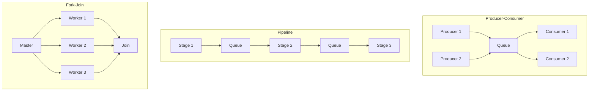
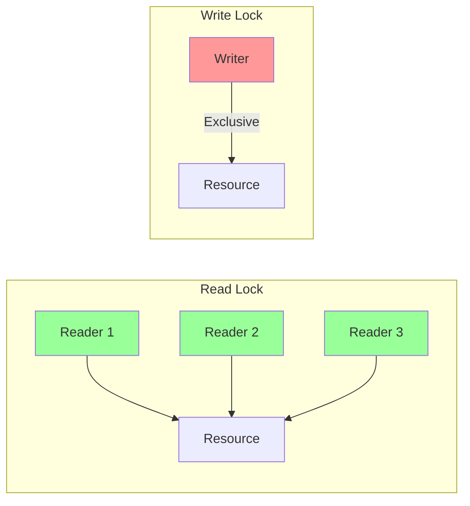
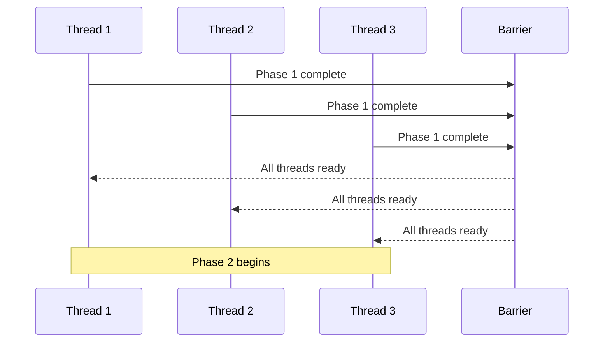
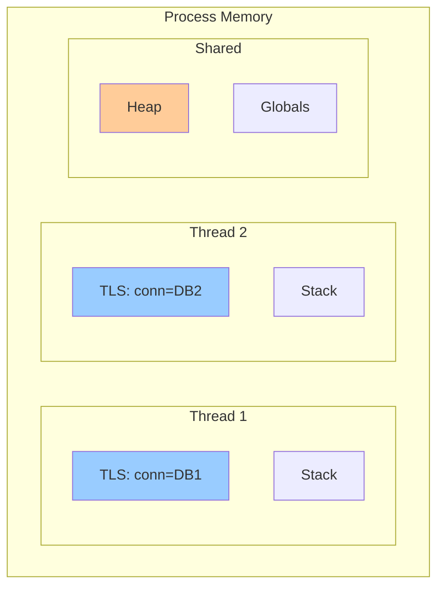
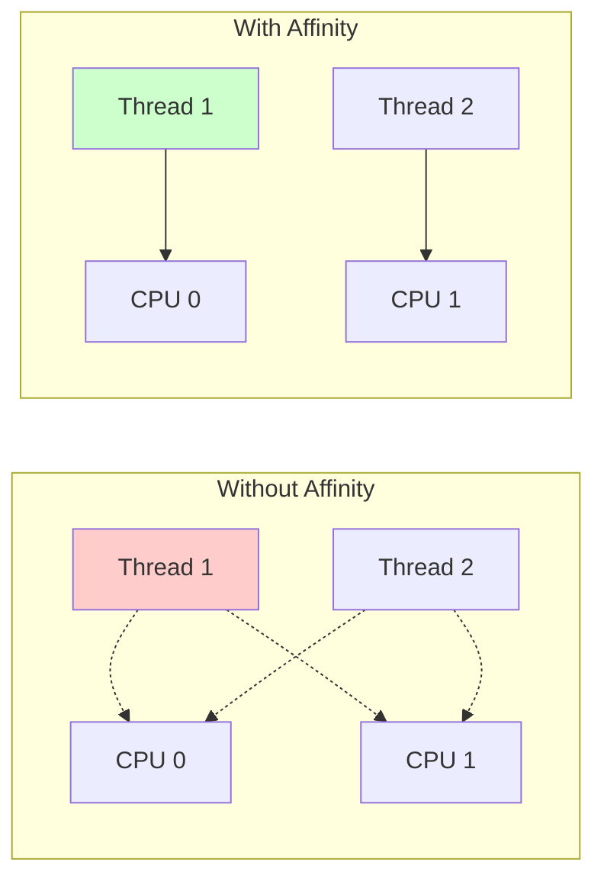
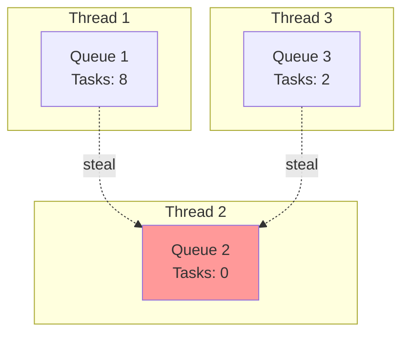

# Module 7: Thread Management and Synchronization

## Table of Contents

- [Overview](#overview)
- [Learning Objectives](#learning-objectives)
- [Thread Coordination Patterns](#thread-coordination-patterns)
- [Advanced Synchronization Primitives](#advanced-synchronization-primitives)
- [Thread-Local Storage (TLS)](#thread-local-storage-tls)
- [Performance Considerations](#performance-considerations)
- [Common Patterns](#common-patterns)
- [Hands-On Examples](#hands-on-examples)
- [Debugging Multi-threaded Applications](#debugging-multi-threaded-applications)
- [Best Practices](#best-practices)
- [Quick Exercise](#quick-exercise)
- [Key Takeaways](#key-takeaways)
- [Next Module](#next-module)

## Overview

This module provides advanced patterns for thread management and synchronization, building on the basics from Module 3. We'll explore sophisticated coordination techniques, performance optimization, and real-world patterns for building robust multi-threaded applications.

**Duration**: 3 minutes

## Learning Objectives

* Master advanced synchronization patterns
* Understand thread-local storage and context
* Learn thread pool optimization techniques
* Implement producer-consumer and pipeline patterns
* Debug and profile multi-threaded applications

## Thread Coordination Patterns



## Advanced Synchronization Primitives

### 1. Reader-Writer Locks

Allow multiple readers or single writer.



### 2. Barriers

Synchronize threads at specific points.



### 3. Semaphore Variants

- **Binary Semaphore**: Like a mutex (0 or 1)
- **Counting Semaphore**: Resource counting
- **Weighted Semaphore**: Variable resource units

## Thread-Local Storage (TLS)



## Performance Considerations

### Lock Contention Analysis

| Metric | Description | Impact |
|--------|-------------|---------|
| Lock wait time | Time threads spend waiting | Direct performance loss |
| Lock hold time | Duration lock is held | Affects other threads |
| Contention ratio | Waiting time / Total time | Overall efficiency |
| Lock frequency | Acquisitions per second | Overhead indicator |
| Critical section size | Code under lock | Parallelism limiter |

### Thread Affinity

Binding threads to specific CPU cores:



## Common Patterns

### 1. Work Stealing

Threads steal work from other threads' queues:



### 2. Double-Checked Locking

Minimize synchronization overhead:

```python
_instance = None
_lock = threading.Lock()

def get_instance():
    if _instance is None:  # First check (no lock)
        with _lock:
            if _instance is None:  # Second check (with lock)
                _instance = create_instance()
    return _instance
```

### 3. Lock-Free Data Structures

Using atomic operations instead of locks:
- Compare-and-swap (CAS)
- Lock-free queues
- Atomic counters

## Hands-On Examples

### Example 1: Advanced Synchronization (`01_advanced_sync.py`)

```python
# Master advanced synchronization primitives
python 01_advanced_sync.py
```

### Example 2: Thread Coordination Patterns (`02_coordination_patterns.py`)

```python
# Implement coordination patterns
python 02_coordination_patterns.py
```

### Example 3: Performance and Debugging (`03_performance_debug.py`)

```python
# Profile and debug multi-threaded code
python 03_performance_debug.py
```

## Debugging Multi-threaded Applications

### Common Issues

| Issue | Symptoms | Solution |
|-------|----------|----------|
| Deadlock | Threads frozen | Lock ordering, timeouts |
| Livelock | Threads busy but no progress | Backoff strategies |
| Race condition | Intermittent bugs | Proper synchronization |
| Starvation | Some threads never run | Fair scheduling |
| Priority inversion | Low priority blocks high | Priority inheritance |

### Debugging Tools

1. **Thread sanitizers**: Detect races
2. **Lock profilers**: Find contention
3. **Trace tools**: Visualize execution
4. **Core dumps**: Post-mortem analysis

## Best Practices

### 1. Minimize Lock Scope

```python
# Bad: Large critical section
with lock:
    data = fetch_data()      # I/O under lock!
    result = process(data)   # CPU work under lock!
    save_result(result)      # I/O under lock!

# Good: Minimal critical section
data = fetch_data()          # No lock needed
result = process(data)       # No lock needed
with lock:
    shared_results.append(result)  # Only shared access locked
```

### 2. Avoid Nested Locks

```python
# Bad: Nested locks risk deadlock
with lock1:
    with lock2:
        # work...

# Good: Single lock or careful ordering
with combined_lock:
    # work...
```

### 3. Use High-Level Constructs

```python
# Good: Use Queue instead of manual locking
queue = Queue()
queue.put(item)    # Thread-safe
item = queue.get() # Thread-safe
```

## Quick Exercise

Run the examples to explore advanced patterns:

```bash
# 1. Advanced synchronization primitives
python 01_advanced_sync.py

# 2. Coordination patterns
python 02_coordination_patterns.py

# 3. Performance analysis
python 03_performance_debug.py
```

## Key Takeaways

✅ Choose the right synchronization primitive for your use case

✅ Thread-local storage avoids synchronization for per-thread data

✅ Profile to identify lock contention bottlenecks

✅ Use established patterns like producer-consumer

✅ Test thoroughly - concurrency bugs are hard to reproduce

## Next Module

[Module 8: Putting It All Together](../08-putting-it-together/README.md) - Build a high-performance API server
