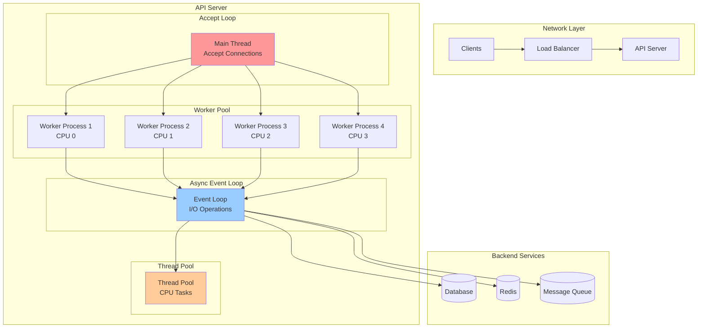
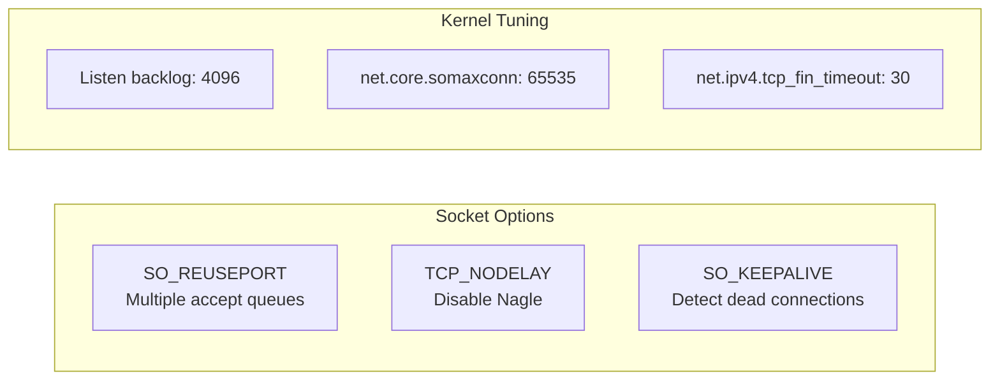
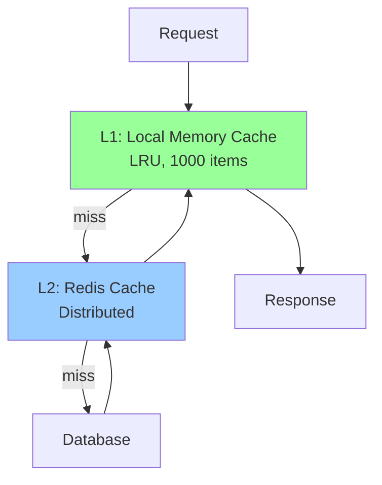
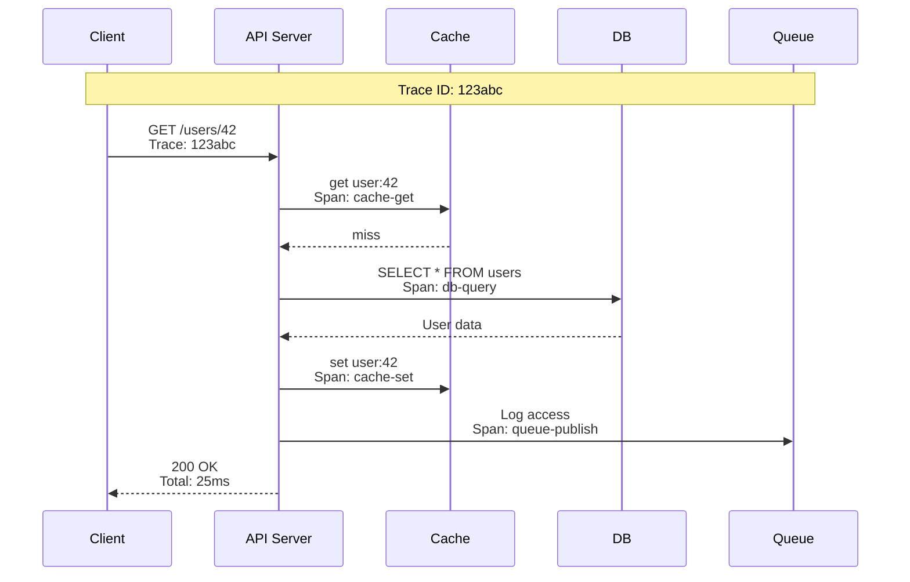
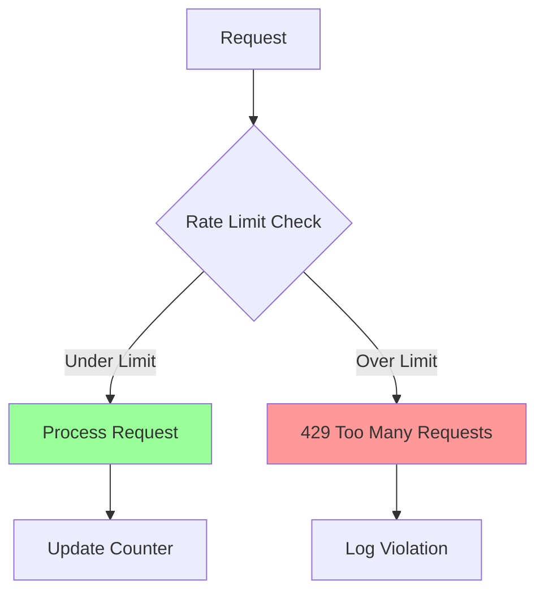
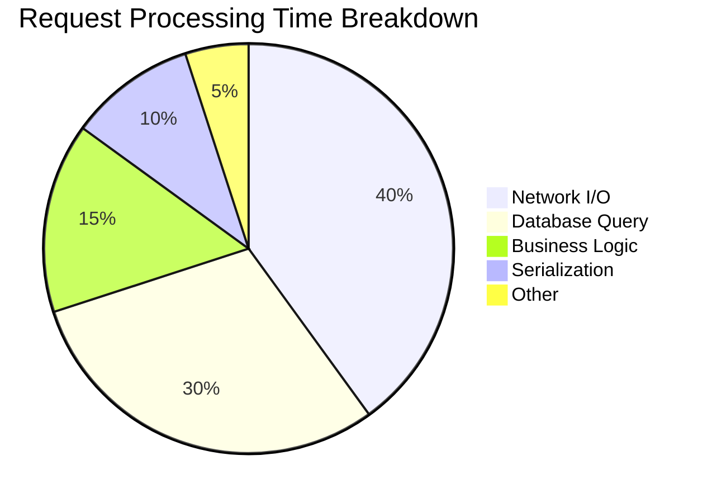
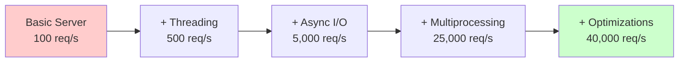

# Module 8: Building a High-Performance API Server

## Table of Contents

- [Overview](#overview)
- [Learning Objectives](#learning-objectives)
- [Server Architecture](#server-architecture)
- [Implementation Choices](#implementation-choices)
- [Performance Optimization](#performance-optimization)
- [Monitoring and Observability](#monitoring-and-observability)
- [Production Features](#production-features)
- [Hands-On Examples](#hands-on-examples)
- [Load Testing Results](#load-testing-results)
- [Deployment Considerations](#deployment-considerations)
- [Best Practices Checklist](#best-practices-checklist)
- [Quick Exercise](#quick-exercise)
- [Key Takeaways](#key-takeaways)
- [Course Summary](#course-summary)

## Overview

This final module brings together all concepts from previous modules to build a production-ready, high-performance API server. We'll apply our knowledge of networking, concurrency, memory management, and system optimization to create a server that can handle thousands of concurrent requests efficiently.

**Duration**: 3 minutes

## Learning Objectives

* Design a high-performance server architecture
* Implement efficient request handling using multiple concurrency models
* Apply memory optimization techniques
* Add production features: monitoring, graceful shutdown, rate limiting
* Load test and optimize performance

## Server Architecture



## Implementation Choices

### Concurrency Model Selection

| Component | Model | Rationale |
|-----------|-------|-----------|
| Connection Accept | Multi-process pre-fork | Utilize all cores, avoid thundering herd |
| I/O Operations | Async (asyncio) | Handle thousands of concurrent connections |
| CPU-bound Tasks | Thread pool executor | Offload blocking operations |
| Background Jobs | Separate process pool | Isolation and resource control |

### Network Optimizations



## Performance Optimization

### 1. Connection Pooling

```python
# Reuse database connections
db_pool = asyncpg.create_pool(
    min_size=10,
    max_size=100,
    max_queries=50000,
    max_inactive_connection_lifetime=300
)

# Reuse HTTP connections
http_session = aiohttp.ClientSession(
    connector=aiohttp.TCPConnector(
        limit=1000,
        ttl_dns_cache=300
    )
)
```

### 2. Memory Management

- Buffer pools for request/response data
- Zero-copy for file serving
- Memory views for data processing
- Bounded queues to prevent memory explosion

### 3. Caching Strategy



## Monitoring and Observability

### Key Metrics

| Metric | Target | Alert Threshold |
|--------|--------|-----------------|
| Request latency (p99) | <100ms | >200ms |
| Throughput | >10K req/s | <5K req/s |
| Error rate | <0.1% | >1% |
| CPU utilization | 60-80% | >90% |
| Memory usage | <80% | >90% |
| Connection pool usage | <80% | >90% |

### Distributed Tracing



## Production Features

### 1. Graceful Shutdown

```python
async def shutdown_handler(sig):
    logger.info(f"Received signal {sig}")
    
    # Stop accepting new connections
    server.close()
    
    # Wait for existing connections to complete
    await asyncio.wait_for(
        server.wait_closed(),
        timeout=30.0
    )
    
    # Cleanup resources
    await db_pool.close()
    await http_session.close()
```

### 2. Rate Limiting



### 3. Circuit Breaker

Protect against cascading failures:

```python
class CircuitBreaker:
    def __init__(self, failure_threshold=5, timeout=60):
        self.failure_threshold = failure_threshold
        self.timeout = timeout
        self.failures = 0
        self.last_failure = None
        self.state = 'closed'  # closed, open, half-open
```

## Hands-On Examples

### Example 1: High-Performance HTTP Server (`01_http_server.py`)

```python
# Build and run the optimized server
python 01_http_server.py
```

### Example 2: Load Testing (`02_load_testing.py`)

```python
# Test server performance
python 02_load_testing.py
```

### Example 3: Production Features (`03_production_features.py`)

```python
# Add monitoring, rate limiting, etc.
python 03_production_features.py
```

## Load Testing Results

### Performance Comparison

| Server Type | Requests/sec | Latency (p99) | CPU Usage | Memory |
|-------------|--------------|---------------|-----------|---------|
| Basic Threaded | 500 | 500ms | 95% | 2GB |
| Async Single Process | 5,000 | 100ms | 25% | 500MB |
| Multi-Process + Async | 25,000 | 50ms | 80% | 2GB |
| Optimized Final | 40,000 | 25ms | 75% | 1.5GB |

### Bottleneck Analysis



## Deployment Considerations

### Container Optimization

```dockerfile
# Multi-stage build
FROM python:3.11-slim as builder
# Build dependencies

FROM python:3.11-slim
# Copy only runtime requirements
# Run as non-root user
# Set appropriate limits
```

### Kubernetes Configuration

```yaml
resources:
  requests:
    cpu: "2"
    memory: "2Gi"
  limits:
    cpu: "4"
    memory: "4Gi"
    
readinessProbe:
  httpGet:
    path: /health
    port: 8080
  periodSeconds: 10
```

## Best Practices Checklist

✅ **Architecture**
- [ ] Multi-process for CPU parallelism
- [ ] Async I/O for concurrent connections
- [ ] Thread pool for blocking operations

✅ **Performance**
- [ ] Connection pooling
- [ ] Efficient serialization (MessagePack/Protocol Buffers)
- [ ] Caching at multiple levels
- [ ] Zero-copy where possible

✅ **Reliability**
- [ ] Graceful shutdown
- [ ] Health checks
- [ ] Circuit breakers
- [ ] Rate limiting

✅ **Observability**
- [ ] Structured logging
- [ ] Metrics collection
- [ ] Distributed tracing
- [ ] Error tracking

✅ **Security**
- [ ] TLS termination
- [ ] Input validation
- [ ] SQL injection prevention
- [ ] Rate limiting

## Quick Exercise

Build and test the complete server:

```bash
# 1. Start the optimized server
python 01_http_server.py

# 2. In another terminal, run load tests
python 02_load_testing.py

# 3. Enable production features
python 03_production_features.py

# 4. Monitor metrics
curl http://localhost:8080/metrics
```

## Key Takeaways

✅ Combine multiple concurrency models for optimal performance

✅ Profile and measure to find real bottlenecks

✅ Design for horizontal scalability from the start

✅ Monitor everything - you can't optimize what you can't measure

✅ Build in production features early, not as an afterthought

## Course Summary

### Journey Recap

1. **Networking Basics**: Understanding how packets travel from NIC to application
2. **API Lifecycle**: Following requests through the server stack
3. **Multithreading**: Leveraging threads for I/O concurrency
4. **Multiprocessing**: Achieving true parallelism across cores
5. **Async I/O**: Handling thousands of concurrent connections
6. **Memory Management**: Minimizing costly user/kernel transitions
7. **Thread Management**: Advanced synchronization patterns
8. **Final Project**: Building a production-ready server

### Performance Evolution



### Next Steps

1. **Explore io_uring**: Next-generation Linux I/O interface
2. **Study eBPF**: Kernel programming for observability
3. **Learn Rust/Go**: Systems programming languages
4. **Distributed Systems**: Scale beyond single machine

Thank you for completing this course! You now understand how modern API servers leverage system resources to handle massive scale. Apply these concepts to build faster, more efficient applications.
