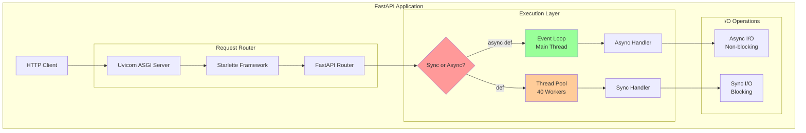
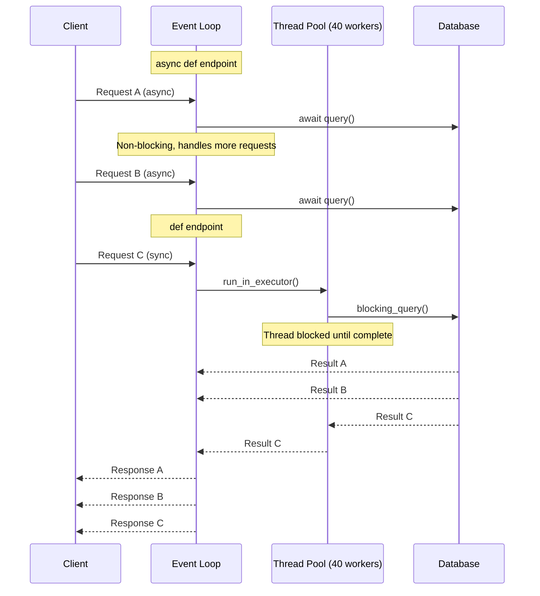
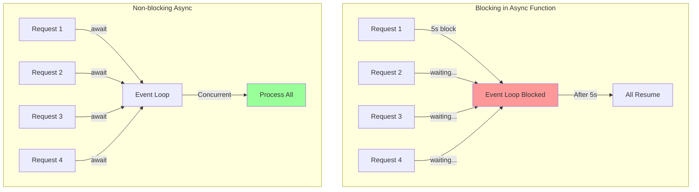
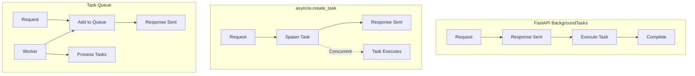

# Module 9: FastAPI Internals and Optimizations

## Table of Contents

- [Overview](#overview)
- [Learning Objectives](#learning-objectives)
- [FastAPI Architecture Deep Dive](#fastapi-architecture-deep-dive)
- [The Thread Pool Secret](#the-thread-pool-secret)
- [Event Loop and Async Magic](#event-loop-and-async-magic)
- [Why Blocking is Bad](#why-blocking-is-bad)
- [Background Tasks Done Right](#background-tasks-done-right)
- [Performance Patterns](#performance-patterns)
- [Common Pitfalls and Solutions](#common-pitfalls-and-solutions)
- [Hands-On Examples](#hands-on-examples)
- [Production Optimizations](#production-optimizations)
- [Monitoring and Debugging](#monitoring-and-debugging)
- [Best Practices Checklist](#best-practices-checklist)
- [Key Takeaways](#key-takeaways)

## Overview

This module explores FastAPI's internal architecture, revealing how it achieves exceptional performance through intelligent handling of sync and async code. We'll uncover the thread pool mechanics, event loop integration, and optimization strategies for building high-performance APIs.

**Duration**: 5 minutes

## Learning Objectives

* Understand FastAPI's dual sync/async architecture
* Master the thread pool mechanics (default 40 threads, not 50!)
* Learn why blocking operations kill async performance
* Implement background tasks efficiently
* Optimize FastAPI applications for production scale

## FastAPI Architecture Deep Dive



### Key Components

1. **ASGI Server (Uvicorn)**: Handles HTTP protocol and connection management
2. **Starlette**: Provides request/response handling and middleware
3. **FastAPI**: Adds validation, serialization, and documentation
4. **AnyIO**: Manages async operations (compatible with asyncio and trio)

## The Thread Pool Secret

FastAPI uses a thread pool to handle synchronous (non-async) path operations. Here's the truth about the thread pool:

```python
# From Starlette's source code
import anyio

# Default thread pool size is 40, not 50!
# This is set by AnyIO's default thread limiter
thread_pool_size = 40  # Can be configured
```

### How the Thread Pool Works



### Thread Pool Configuration

```python
# Configure thread pool size (example)
import anyio
from contextlib import asynccontextmanager

@asynccontextmanager
async def lifespan(app):
    # Set thread pool size on startup
    limiter = anyio.to_thread.current_default_thread_limiter()
    limiter.total_tokens = 100  # Increase from default 40
    yield

app = FastAPI(lifespan=lifespan)
```

## Event Loop and Async Magic

### How FastAPI Decides Execution Mode

```python
# FastAPI's internal logic (simplified)
def route_handler(func):
    if asyncio.iscoroutinefunction(func):
        # Direct execution on event loop
        return func
    else:
        # Wrap in thread pool executor
        async def wrapper(*args, **kwargs):
            return await anyio.to_thread.run_sync(func, *args, **kwargs)
        return wrapper
```

### Event Loop Visualization

```mermaid
graph LR
    subgraph "Event Loop (Single Thread)"
        TASK1[Task 1: await db.query()]
        TASK2[Task 2: await http.get()]
        TASK3[Task 3: await file.read()]
        SCHEDULER[Scheduler]
        
        SCHEDULER -->|Running| TASK1
        TASK1 -->|I/O Wait| SCHEDULER
        SCHEDULER -->|Switch| TASK2
        TASK2 -->|I/O Wait| SCHEDULER
        SCHEDULER -->|Switch| TASK3
        TASK3 -->|Complete| SCHEDULER
        SCHEDULER -->|Resume| TASK1
    end
    
    style SCHEDULER fill:#ff9999
    style TASK1 fill:#99ccff
    style TASK2 fill:#99ffcc
```

## Why Blocking is Bad

### The Blocking Problem

```python
# BAD: Blocks the entire event loop
@app.get("/bad")
async def bad_endpoint():
    time.sleep(5)  # BLOCKS EVENT LOOP! 
    return {"status": "done"}

# GOOD: Non-blocking sleep
@app.get("/good")
async def good_endpoint():
    await asyncio.sleep(5)  # Yields to event loop
    return {"status": "done"}
```

### Impact Visualization



## Background Tasks Done Right

### Method 1: FastAPI Background Tasks

```python
from fastapi import BackgroundTasks

@app.post("/send-notification/")
async def send_notification(
    email: str, 
    background_tasks: BackgroundTasks
):
    # Quick response to client
    background_tasks.add_task(send_email_notification, email)
    return {"message": "Notification will be sent"}

# Runs after response is sent
def send_email_notification(email: str):
    # Can be sync or async
    send_email(email)
```

### Method 2: Fire-and-Forget with asyncio

```python
import asyncio

@app.post("/process-data/")
async def process_data(data: dict):
    # Create task but don't await it
    asyncio.create_task(process_in_background(data))
    
    # Return immediately
    return {"status": "processing started"}

async def process_in_background(data: dict):
    try:
        await asyncio.sleep(1)  # Simulate work
        await db.save(processed_data)
    except Exception as e:
        logger.error(f"Background processing failed: {e}")
```

### Method 3: Task Queue Pattern

```python
from asyncio import Queue

# Global task queue
task_queue = Queue()

@app.on_event("startup")
async def startup_event():
    # Start background worker
    asyncio.create_task(background_worker())

async def background_worker():
    while True:
        task = await task_queue.get()
        try:
            await process_task(task)
        except Exception as e:
            logger.error(f"Task failed: {e}")

@app.post("/queue-task/")
async def queue_task(task_data: dict):
    await task_queue.put(task_data)
    return {"status": "queued", "queue_size": task_queue.qsize()}
```

### Background Task Patterns Comparison



## Performance Patterns

### 1. Async All The Way

```python
# Use async libraries throughout
@app.get("/users/{user_id}")
async def get_user(user_id: int):
    # Async database query
    user = await db.fetch_one(
        "SELECT * FROM users WHERE id = $1", 
        user_id
    )
    
    # Async HTTP call
    async with httpx.AsyncClient() as client:
        profile = await client.get(f"https://api.example.com/profile/{user_id}")
    
    # Async cache operation
    await redis.set(f"user:{user_id}", user)
    
    return {"user": user, "profile": profile.json()}
```

### 2. Dependency Injection Optimization

```python
# Reuse expensive objects
async def get_db_session():
    async with async_session() as session:
        yield session

async def get_http_client():
    async with httpx.AsyncClient() as client:
        yield client

@app.get("/optimized")
async def optimized_endpoint(
    db: AsyncSession = Depends(get_db_session),
    http: httpx.AsyncClient = Depends(get_http_client)
):
    # Reuses connections efficiently
    data = await db.execute(select(User))
    external = await http.get("https://api.example.com")
    return {"data": data, "external": external.json()}
```

### 3. Streaming Responses

```python
from fastapi.responses import StreamingResponse

async def generate_large_data():
    for i in range(1000000):
        yield f"data: {i}\n"
        await asyncio.sleep(0)  # Yield control

@app.get("/stream")
async def stream_data():
    return StreamingResponse(
        generate_large_data(),
        media_type="text/plain"
    )
```

## Common Pitfalls and Solutions

### Pitfall 1: Mixing Sync and Async Incorrectly

```python
# WRONG: Sync call in async function
@app.get("/wrong")
async def wrong_endpoint():
    result = requests.get("https://api.example.com")  # BLOCKS!
    return result.json()

# RIGHT: Use async HTTP client
@app.get("/right")
async def right_endpoint():
    async with httpx.AsyncClient() as client:
        result = await client.get("https://api.example.com")
    return result.json()
```

### Pitfall 2: CPU-Bound in Async

```python
# WRONG: CPU-intensive in async
@app.get("/compute-wrong")
async def compute_wrong():
    result = complex_calculation()  # Blocks event loop!
    return {"result": result}

# RIGHT: Offload to thread pool
@app.get("/compute-right")
async def compute_right():
    result = await anyio.to_thread.run_sync(complex_calculation)
    return {"result": result}
```

### Pitfall 3: Not Handling Exceptions in Background Tasks

```python
# WRONG: Exceptions silently fail
@app.post("/task-wrong")
async def create_task_wrong():
    asyncio.create_task(might_fail())  # Exception lost!
    return {"status": "started"}

# RIGHT: Proper exception handling
@app.post("/task-right")
async def create_task_right():
    task = asyncio.create_task(might_fail_handled())
    task.add_done_callback(handle_task_exception)
    return {"status": "started"}

async def might_fail_handled():
    try:
        await risky_operation()
    except Exception as e:
        logger.exception("Task failed")
        await notify_error(e)

def handle_task_exception(task):
    try:
        task.result()
    except Exception as e:
        logger.exception("Unhandled task exception")
```

## Hands-On Examples

### Example 1: FastAPI Internals Explorer (`01_fastapi_internals.py`)

```python
# Explore thread pool and async behavior
python 01_fastapi_internals.py
```

### Example 2: Background Task Patterns (`02_background_tasks.py`)

```python
# Compare different background task approaches
python 02_background_tasks.py
```

### Example 3: Performance Comparison (`03_performance_comparison.py`)

```python
# Benchmark sync vs async endpoints
python 03_performance_comparison.py
```

## Production Optimizations

### 1. Connection Pooling

```python
# Database connection pool
async_engine = create_async_engine(
    DATABASE_URL,
    pool_size=20,
    max_overflow=40,
    pool_pre_ping=True,
    pool_recycle=3600
)

# HTTP connection pooling
http_client = httpx.AsyncClient(
    limits=httpx.Limits(
        max_keepalive_connections=20,
        max_connections=100,
        keepalive_expiry=30
    )
)

@app.on_event("shutdown")
async def shutdown():
    await http_client.aclose()
    await async_engine.dispose()
```

### 2. Response Caching

```python
from functools import lru_cache
from fastapi import Request
import hashlib

# In-memory cache with TTL
cache = {}

async def cached_endpoint(
    key_func, 
    ttl_seconds: int = 300
):
    def decorator(func):
        async def wrapper(request: Request, *args, **kwargs):
            # Generate cache key
            cache_key = key_func(request, *args, **kwargs)
            
            # Check cache
            if cache_key in cache:
                data, timestamp = cache[cache_key]
                if time.time() - timestamp < ttl_seconds:
                    return data
            
            # Compute result
            result = await func(request, *args, **kwargs)
            cache[cache_key] = (result, time.time())
            return result
        return wrapper
    return decorator

@app.get("/cached/{item_id}")
@cached_endpoint(
    lambda req, item_id: f"item:{item_id}",
    ttl_seconds=60
)
async def get_cached_item(item_id: int):
    # Expensive operation
    return await fetch_item(item_id)
```

### 3. Request Batching

```python
from dataclasses import dataclass
from typing import List
import asyncio

@dataclass
class BatchRequest:
    id: str
    future: asyncio.Future

batch_queue: List[BatchRequest] = []
batch_lock = asyncio.Lock()

async def batch_processor():
    while True:
        await asyncio.sleep(0.01)  # 10ms batching window
        
        async with batch_lock:
            if not batch_queue:
                continue
                
            batch = batch_queue.copy()
            batch_queue.clear()
        
        # Process entire batch at once
        ids = [req.id for req in batch]
        results = await db.fetch_many(ids)
        
        # Resolve futures
        for req, result in zip(batch, results):
            req.future.set_result(result)

@app.on_event("startup")
async def startup():
    asyncio.create_task(batch_processor())

@app.get("/batched/{item_id}")
async def get_batched(item_id: str):
    future = asyncio.Future()
    
    async with batch_lock:
        batch_queue.append(BatchRequest(item_id, future))
    
    return await future
```

## Monitoring and Debugging

### Performance Metrics

```python
import time
from prometheus_client import Histogram, Counter

request_duration = Histogram(
    'http_request_duration_seconds',
    'HTTP request latency',
    ['method', 'endpoint', 'status']
)

thread_pool_usage = Gauge(
    'thread_pool_active_threads',
    'Number of active threads in the pool'
)

@app.middleware("http")
async def monitor_performance(request: Request, call_next):
    start_time = time.time()
    
    # Monitor thread pool
    limiter = anyio.to_thread.current_default_thread_limiter()
    thread_pool_usage.set(
        limiter.borrowed_tokens
    )
    
    response = await call_next(request)
    
    # Record metrics
    duration = time.time() - start_time
    request_duration.labels(
        method=request.method,
        endpoint=request.url.path,
        status=response.status_code
    ).observe(duration)
    
    return response
```

### Debug Mode

```python
import logging
import sys

# Enable debug logging
logging.basicConfig(
    level=logging.DEBUG,
    format='%(asctime)s - %(name)s - %(levelname)s - %(message)s',
    stream=sys.stdout
)

# Log async/sync detection
@app.middleware("http")
async def log_execution_mode(request: Request, call_next):
    endpoint = request.url.path
    
    # Check if endpoint is async
    route = request.scope.get("route")
    if route:
        is_async = asyncio.iscoroutinefunction(route.endpoint)
        logger.debug(f"{endpoint} - Async: {is_async}")
    
    return await call_next(request)
```

## Best Practices Checklist

✅ **Async/Sync Decision Tree**
- [ ] Use `async def` for I/O operations with async libraries
- [ ] Use `def` for CPU-bound or sync-only operations
- [ ] Never block the event loop with sync calls in async functions
- [ ] Profile to verify your assumptions

✅ **Background Tasks**
- [ ] Use FastAPI BackgroundTasks for post-response work
- [ ] Use asyncio.create_task for fire-and-forget operations
- [ ] Always handle exceptions in background tasks
- [ ] Consider a proper task queue for complex workflows

✅ **Performance Optimization**
- [ ] Use connection pooling for databases and HTTP clients
- [ ] Implement caching where appropriate
- [ ] Stream large responses instead of loading in memory
- [ ] Batch requests when possible

✅ **Monitoring**
- [ ] Track request latency by endpoint
- [ ] Monitor thread pool usage
- [ ] Log slow operations
- [ ] Set up alerts for performance degradation

✅ **Code Organization**
- [ ] Keep CPU-intensive operations in sync functions
- [ ] Use dependency injection for shared resources
- [ ] Separate business logic from request handling
- [ ] Write tests for both sync and async code paths

## Key Takeaways

✅ FastAPI intelligently routes sync functions to a thread pool (default 40 threads)

✅ Async functions run directly on the event loop for maximum concurrency

✅ Blocking operations in async functions destroy performance - avoid at all costs

✅ Background tasks have multiple patterns - choose based on your needs

✅ Connection pooling and caching are essential for production performance

✅ Monitor everything - you can't optimize what you don't measure

✅ The key to FastAPI performance is understanding when to use sync vs async

## Performance Comparison

```mermaid
graph LR
    subgraph "Request Types"
        SYNC[Sync Endpoint<br/>def handler()] 
        ASYNC[Async Endpoint<br/>async def handler()]
    end
    
    subgraph "Execution"
        THREAD[Thread Pool<br/>40 workers]
        LOOP[Event Loop<br/>Single thread]
    end
    
    subgraph "Best For"
        CPU[CPU-bound<br/>Sync libraries]
        IO[I/O-bound<br/>Async libraries]
    end
    
    SYNC --> THREAD
    ASYNC --> LOOP
    THREAD --> CPU
    LOOP --> IO
    
    style ASYNC fill:#99ff99
    style IO fill:#99ff99
    style SYNC fill:#ffcc99
    style CPU fill:#ffcc99
```

FastAPI's magic lies in its ability to seamlessly handle both sync and async code, optimizing each for its use case. Master these patterns, and you'll build APIs that can handle massive scale with ease.
