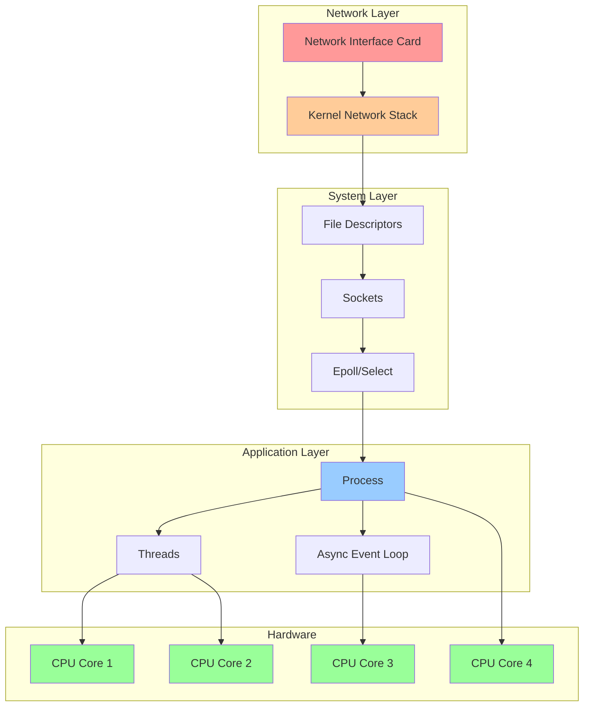
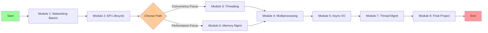

# Python Systems Programming: From API Request to CPU Core


## Table of Contents

- [Course Overview](#course-overview)
- [What You'll Learn](#what-youll-learn)
- [Prerequisites](#prerequisites)
- [Course Structure](#course-structure)
- [Quick Start](#quick-start)
- [System Architecture Overview](#system-architecture-overview)
- [Key Concepts Covered](#key-concepts-covered)
- [Learning Path](#learning-path)
- [Resources and References](#resources-and-references)

## Course Overview

This hands-on course demystifies how modern servers handle API requests using multiple cores, threads, and system-level operations. Through practical Python examples, you'll understand the journey of an HTTP request from network card to application response.

### What You'll Learn

* How network packets travel from NIC to your application
* The role of file descriptors and sockets in networking
* User space vs kernel space operations and their performance impact
* Multithreading vs multiprocessing vs async I/O
* Thread management and synchronization primitives
* Real-world patterns for building high-performance servers

### Prerequisites

* Basic Python knowledge
* Command line familiarity
* Basic understanding of HTTP/REST APIs

### Course Structure

| Module | Topic | Duration |
|--------|-------|----------|
| [Module 1](01-networking-basics/README.md) | Networking Fundamentals: NICs, Sockets, and File Descriptors | 4 min |
| [Module 2](02-api-lifecycle/README.md) | API Request Lifecycle: From Network to Application | 4 min |
| [Module 3](03-multithreading/README.md) | Multithreading in Python: Concurrent Request Handling | 4 min |
| [Module 4](04-multiprocessing/README.md) | Multiprocessing: True Parallelism Across CPU Cores | 4 min |
| [Module 5](05-async-io/README.md) | Async I/O: Event-Driven Concurrency | 4 min |
| [Module 6](06-memory-management/README.md) | Memory Management: User Space vs Kernel Space | 4 min |
| [Module 7](07-thread-management/README.md) | Thread Management and Synchronization | 3 min |
| [Module 8](08-putting-it-together/README.md) | Building a High-Performance API Server | 3 min |
| [Module 9](09-fastapi-internals/README.md) | FastAPI Internals and Optimizations | 5 min |

## Quick Start

```bash
# Clone the repository
git clone <repository-url>
cd course

# Create virtual environment
python3 -m venv venv
source venv/bin/activate  # On Windows: venv\Scripts\activate

# Install dependencies
pip install -r requirements.txt

# Start with Module 1
cd 01-networking-basics
python 01_socket_basics.py
```

## System Architecture Overview



## Key Concepts Covered

### 🔌 Networking Stack
* Network Interface Cards (NICs) and packet reception
* Interrupt handling and DMA (Direct Memory Access)
* Socket creation and file descriptor management
* TCP/IP stack traversal

### 🔄 Concurrency Models
* **Threading**: Shared memory, GIL limitations, I/O bound tasks
* **Multiprocessing**: True parallelism, IPC overhead, CPU bound tasks
* **Async I/O**: Event loops, coroutines, massive concurrency

### 💾 Memory Operations
* User space vs kernel space separation
* System calls and context switching costs
* Zero-copy techniques
* Buffer management strategies

### ⚡ Performance Considerations
* Connection pooling
* Load balancing across cores
* Cache locality and NUMA awareness
* Measuring and optimizing latency

## Learning Path



## Resources and References

* [Python Socket Programming](https://docs.python.org/3/library/socket.html)
* [Python Threading Documentation](https://docs.python.org/3/library/threading.html)
* [Python Multiprocessing Documentation](https://docs.python.org/3/library/multiprocessing.html)
* [Python Asyncio Documentation](https://docs.python.org/3/library/asyncio.html)
* [Glossary of Terms](resources/glossary.md)
* [Performance Benchmarks](resources/benchmarks.md)

## Contributing

Feel free to submit issues or pull requests to improve this course material.

## License

This course is provided under the MIT License.
